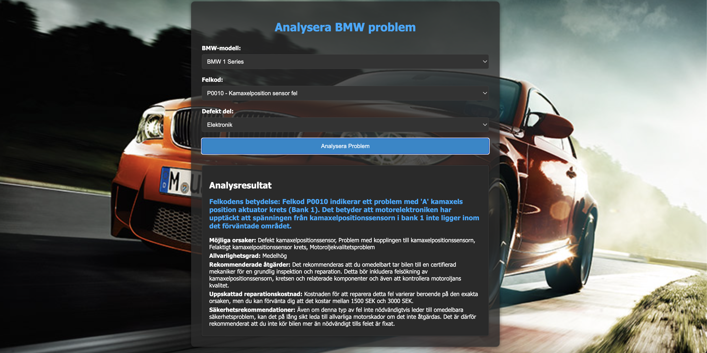

# 🚗 BMW Diagnostic Assistant


## 🎯 Översikt
BMW Diagnostic Assistant är ett kraftfullt verktyg som använder artificiell intelligens för att analysera och optimera BMW-fordon. Systemet hjälper både ägare och mekaniker genom att leverera realtidsdata, prediktiva insikter och prestandaoptimering.

## ✨ Huvudfunktioner

- 🔍 **Realtidsdiagnostik**
  - Kontinuerlig övervakning av fordonets status
  - Direkta varningar vid avvikelser
  - Detaljerad diagnostisk information

- 🤖 **AI-Driven Prediktivt Underhåll**
  - Förutser servicebehov innan problem uppstår
  - Anpassade underhållsscheman
  - Kostnadseffektiv fordonshantering

- ⚡ **Prestandaoptimering**
  - Intelligenta rekommendationer för bränsleeffektivitet
  - Motorprestandaanalys
  - Anpassade körprofiler

- 📊 **Avancerad Dataanalys**
  - Omfattande historisk dataövervakning
  - Trendanalyser och rapporter
  - Personliga insikter

## 🚀 Kom igång

### Förutsättningar
- Node.js (v14+)
- npm
- Kompatibel BMW-modell

### Installation

1. Klona projektet
```bash
git clone git@github.com:husseinkareem/BMW-Diagnostic-Assistant.git
```

2. Installera beroenden
```bash
cd BMW-Diagnostic-Assistant
npm install
```

3. Starta applikationen
```bash
npm start
```

## 📁 Projektstruktur

```
BMW-Diagnostic-Assistant/
├── src/           # Källkod och AI-modeller
├── tests/         # Automatiserade tester
├── docs/          # Dokumentation
└── data/          # Analysdata och resultat
```

## 📱 Skärmdumpar

<div align="center">
  <table>
    <tr>
      <td></td>
      <!-- Lägg till fler bilder här när de finns tillgängliga -->
    </tr>
  </table>
</div>

## 📄 Licens
Detta projekt är licensierat under MIT-licensen.